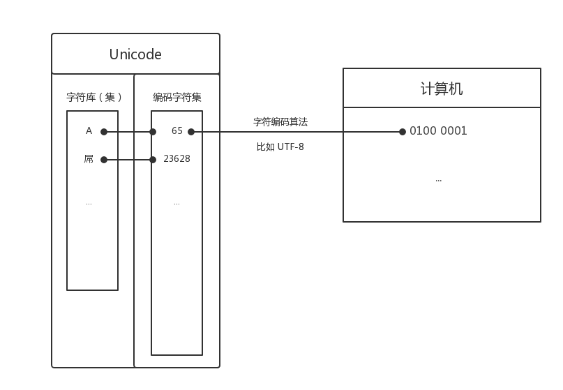
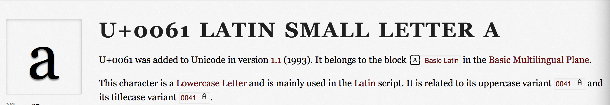
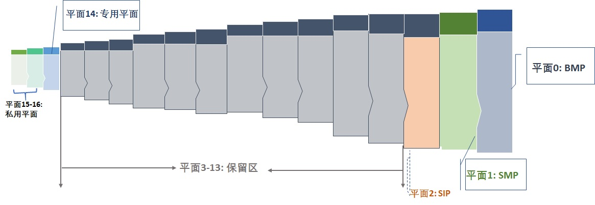
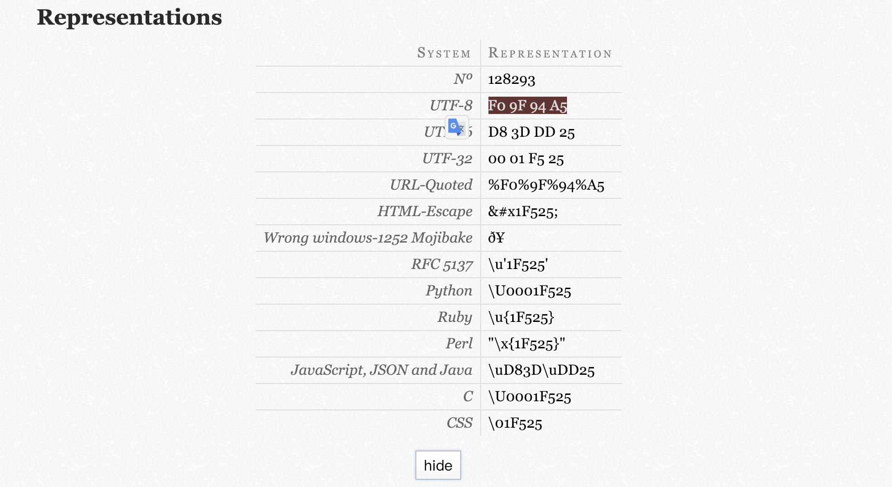
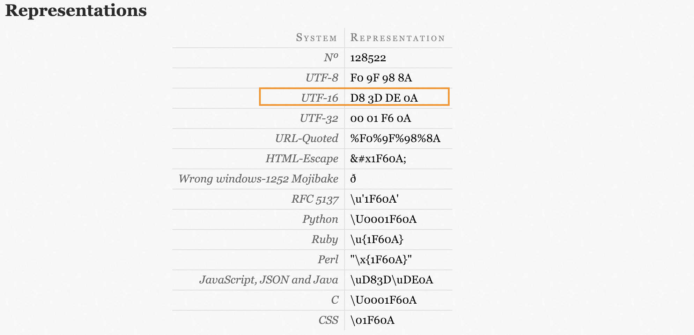
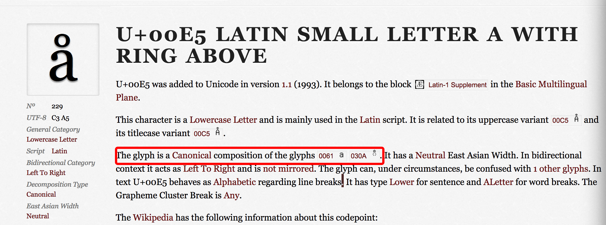

# Unicode 基础

作为规范阅读学习的开篇，自感万事开头难，幸得 `ECMAScript 5.1` 规范前三章节还是比较平易近人。

1. [Scope](http://www.ecma-international.org/ecma-262/5.1/index.html#sec-1)

2. [Conformance](http://www.ecma-international.org/ecma-262/5.1/index.html#sec-2)

3. [Normative references](http://www.ecma-international.org/ecma-262/5.1/index.html#sec-3)

切记不要一扫而过，这里有一个常被人忽视的知识点：

> A conforming implementation of this Standard shall interpret characters in conformance with the Unicode Standard, Version 3.0 or later and ISO/IEC 10646-1 with either UCS-2 or UTF-16 as the adopted encoding form, implementation level 3. If the adopted ISO/IEC 10646-1 subset is not otherwise specified, it is presumed to be the BMP subset, collection 300. If the adopted encoding form is not otherwise specified, it presumed to be the UTF-16 encoding form.

`JavaScript` 诞生之时 `UTF-16` 尚未问世，故采用的是 `UCS-2`，后经多年填坑补烂至今(ES6) 完善了对 `Unicode`、`UTF-16` 的支持。

上述引用中最后一句也提到了如果没指定编码格式，默认是 `UTF-16` 的（绝大多数 `JavaScript` 引擎使用的正是 `UTF-16`）！

这段话中同时提到了好些名词：`BMP`、`Unicode`、`UCS-2`、`UTF-16` 等等，本文的愿景就是图文并茂、浅显易懂的总结相关的知识点。

## [Unicode](https://zh.wikipedia.org/wiki/Unicode)

> [Unicode 官网](http://unicode.org/)

计算机是最灵性也是最笨的，你敲下的每一行字，收藏的每个表情，存下的每张照片...计算机都不能直接的"理解"，它能处理的最小单位就是[```bit```](https://zh.wikipedia.org/wiki/%E4%BD%8D%E5%85%83)，也常常被叫做**位**。

> 1字节（Byte）= 8 比特（bit），1 比特只能有 ```Math.pow(2, 1)``` 个变化（0 或 1，逻辑真或逻辑假，或者别的方式），1 字节有```Math.pow(2, 8)``` 个变化。

```js
// 哪怕是经典
hello world!
```

抱歉，计算机其实并不懂 ```hello world!``` 的含义，只是将其理解为特定的比特序列。

用一个特定的比特序列表示一个特定的字符（`Character`），这个过程其实就是所谓的"编码（`encode`）"。反之，将计算机中存储的比特序列（也有叫二进制序列的）解析成对应的字符，这个过程就叫做"解码（`decode`）"。

编解码过程隐约的暴露出需要一种对应关系，能够最终映射字符与存储的比特序列的对应关系，这就需要字符集了。简而言之，字符集就是电脑编解码领域的"新华字典"。

然而，当这种字典多种多样的时候就不好玩儿了。

遗憾的是，这样的字典有：`ASCII` 字符集、`ISO-8859-X`、`GB2312` 字符集（简中）、`BIG5` 字符集（繁中）、`GB18030` 字符集、`Shift-JIS` 等等...

多种多样的字符集，然后还有多种多样的字符编码，错综复杂，一个字，乱！

所以 `Unicode` 诞生了！

__简单的说 `Unicode` 就是提供一个全球统一的标准字符集，其目的就是在全世界范围内收集各种字符，并且为其分配一个唯一的码点（`Code Point`）与之对应(码点相当于字符的唯一标识符)。__

`Unicode` 的通用性与开放性解决了过去一直存在的一个问题：供应商们各自实现不同的字符集和编码规则，很难处理且混乱不堪。

```js
// 比如 A 的码点 U+0041
'A'.codePointAt(0) // 65 -> 16进制表示为 0x0041

// 比如 🔥 的码点 U+1F525
'🔥'.codePointAt(0) // 128293 -> 16进制表示为 0x1F525
```

### 字符集与字符编码

很多人容易混淆二者。举个最简单的例子，Unicode 就是字符集，UTF-8 就是[字符编码](https://en.wikipedia.org/wiki/Character_encoding)。

通过字符集实现编解码需要三个要素：

1. 字库表(集)（`character repertoire`）-- 存有所有字符，比如 `A`，`🔥`
2. 编码字符集（`coded character set`）-- 存有给字符分配的唯一码点
3. 字符编码（`character encoding form`）-- 一种映射算法

字库表决定了整个字符集能够展现表示的所有字符的范围，编码字符集就是用码点（ `Code Point` ）来表示字符在字库表中的索引，这里表现了**字符与码点的映射关系**，码点就是字符的 ```id```（想象一下数组通过下标取值）。

字符编码的目的就是将 `Unicode` 编码空间中每个码点和比特序列进行一一映射的算法，也就是表现了**码点与比特序列的映射关系**。

所以最终可以实现字符到字符序列的映射，为编解码过程提供了"新华字典"。

目前常用的字符编码有 `UTF-8`、`UTF-16`、`UTF-32`等，实质区别是在产出二进制的长度上，从而使存储的开销上有差异（比如 `UTF-8` 这种可变长编码就比 `UTF-32` 这种定长，需要字节更多的编码方式更节省空间）。



### 字符与码点

> 抽象字符是组织、管理或表现文本数据的信息单位。

`Unicode` 中的字符是一个抽象的概念，每个抽象字符都有对应的名称（比如：`LATIN SMALL LETTER A`），此外还有对应的图像表现形式，叫做字形（`glyph`），比如 `a`， `🚀`，`屌`...

> 这里有一个[工具网站](https://codepoints.net/U+0061)可以查询字符的具体信息。



码点的概念上边已经提到了，就是一个数字，是某些抽象字符的唯一标识。其表现形式是 ```U+<hex>```，`U+` 是代表 `Unicode` 的前缀，而 `<hex>` 是一个 16 进制数。

比如：`a` 的码点 `U+0061`，`🚀` 的码点 `U+1F680`

这里复习一下：数值的进制，更多请参考[这里](https://javascript.ruanyifeng.com/grammar/number.html)

- 十进制：没有前导 `0` 的数值。
- 八进制：有前缀 `0o` 或 `0O` 的数值，或者有前导 `0`、且只用到 `0-7` 的八个阿拉伯数字的数值。
- 十六进制：有前缀 `0x` 或 `0X` 的数值。
- 二进制：有前缀 `0b` 或 `0B` 的数值

默认情况下，`JavaScript` 内部会自动将八进制、十六进制、二进制转为十进制。

```js
// 牢记码点就是一个数字！！，不管是八进制还是十进制还是十六进制。
String.fromCodePoint(0x0061) // a
String.fromCodePoint(97) // a
String.fromCodePoint(0141) // a

String.fromCodePoint(0x1F680) // 🚀
```

那么 `Unicode` 有多少个字符？又有多少个码点？

__截止 2018年12月10日，Unicode 12.0 版本，分配了码点的字符共有 137,929 个。__

码点的取值范围是 `U+0000` 到 `U+10FFFF`。也就是说码点有多达 `1114111` 个！

```js
console.log(0x10FFFF) // 1114111
```

⚠️：并不是每个码点都分配了字符的！

### `Unicode` 平面

码点的取值范围是 `U+0000` 到 `U+10FFFF`。通过 `Unicode` 平面对码点进行划分。

__`Unicode` 平面是一个抽象概念。表示的是从 `U+n0000` 到 `U+nFFFF`的区间，每个平面有 `65536`(`0xFFFF`) 个连续码点，`n` 的取值从 `0`(`0x00`) 到 `16`(`0x10`)，所以一共有 `17` 个平面。__

```js
// 每个平面有多少个连续码点
console.log(0xFFFF) // 65535，从 0 到 65535 一共有 65536 个码点

// 多少个平面
console.log(0x10) // 16，从 0 到 16 一个有 17 个平面
```

也就是拆分成了 17 组平面：

- 平面 `0`（该平面也被叫做 `BMP`）: 包含从 `U+0000` 到 `U+FFFF` 的代码点。
- 平面 `1`（该平面也被叫做 `SMP`）: 包含从 `U+10000` 到 `U+1FFFF` 的代码点。
- ... 
- 平面 `15`（该平面也被叫做 `PUA-A`）: 包含从 `U+F0000` 到 `U+FFFFF` 的代码点。
- 平面 `16`（该平面也被叫做 `PUA-B`）: 包含从 `U+100000` 到 `U+10FFFF` 的代码点。

整理了一个表格：

| 平面 | 码点区间 | 中文名称 | 英文名称 |
| ------ | ------ | ------ | ------ |
| 平面 0 | U+0000 - U+FFFF | 基本多文种平面 | Basic Multilingual Plane，简称BMP |
| 平面 1 | U+10000 - U+1FFFF | 多文种补充平面 | Supplementary Multilingual Plane，简称SMP |
| 平面 2 | U+20000 - U+2FFFF | 表意文字补充平面 | Supplementary Ideographic Plane，简称SIP |
| 平面 3 | U+30000 - U+3FFFF | 表意文字第三平面（未正式使用） | Tertiary Ideographic Plane，简称TIP |
| 平面 4 至 13 | U+40000 - U+DFFFF | 尚未使用 |  |
| 平面 14 | U+E0000 - U+EFFFF | 特别用途补充平面 | Supplementary Special-purpose Plane，简称SSP |
| 平面 15 | U+F0000 - U+FFFFF | 保留作为私人使用区（A区） | Private Use Area-A，简称PUA-A |
| 平面 16 | U+100000 - U+10FFFF | 保留作为私人使用区（B区） | Private Use Area-B，简称PUA-B |

图形化表示：



对于 `BMP` 之外的平面可以统称为补充平面。

`BMP` 平面码点取值从 `U+0000` 到 `U+FFFF`，最多可以有 4 位 16 进制数字。大多数现代语言的字符都在 `BMP` 平面内。在这个区间内的很多操作，比如获取字符长度、反转都没问题。但是在补充平面的区间中，就有很多坑点了。

### `Code Unit`

`Unicode` 定义了字符到码点的映射，这仍然是抽象的，计算机依然无法理解，所以需要通过字符编码（比如：UTF-8）将抽象的码点转换为物理层面的比特序列。

这个物理层面的比特序列就叫做码元（`code unit`），它才是最终能够被计算机理解的形式，是计算机物理层面存储文本信息的基本单元。

这里有一个有趣的问题，我们常常用到 `UTF-8` 或者 `UTF-16`，可能部分童鞋也知道前者的中英文全名：8 位统一码转换格式（`Unicode Transformation Format - 8`）。

那么，这里的 `8`（或者 `16`） 指的是什么?

**8 其实指的就是码元（`code unit`）的大小（`8 bit`）！通俗的说就是 `UTF-8` 的最小单位就是 1 字节，`UTF-16` 的最小单位是 2 字节。**

#### `UTF-8`

`UTF-8` 是针对 `Unicode` 的可变长字符编码，用 1-4 个字节编码 `Unicode` 字符。

> 2003年11月 `UTF-8` 被 `RFC 3629` 重新规范，只能使用原来 `Unicode` 定义的区域，`U+0000` 到 `U+10FFFF`，也就是说**最多 4 个字节**

**可变长**的好处在于对空间开销的优化，举个例子，对于一个 `ASCII`字符（比如一个英文字母），只需要 7 `bit` 表示，但是 `Unicode` 最少都是 2 个字节表示的，这就造成了空间的浪费！

> UTF-32 就是固定长度字符编码，而且最小单位是 4 字节。所以......它在某些场景被禁止使用。

`UTF-8` 的编码规则：

> `ASCII`：
>   如前文所说，1 个字节可以表示 256（`Math.pow(2, 8)`）种状态，也就是可以表示 256 个字符。</br>
>   `ASCII` 码一共规定了 128 个字符的编码（你可以点击[查看所有 `ASCII` 码](http://tool.oschina.net/commons?type=4)），这 128 个符号只占用了一个字节的后面 7 位（2 的 7次方 = 128），最前面的 1 位统一规定为 0。

1. 对于 `128` 个 `ASCII` 字符只需一个字节表示，字节的第一位补 0，后面 7 位为这个字符的 `ASCII` 二进制数。`Unicode` 范围为 `U+0000` 至 `U+007F`。
2. 对于 `n` 字节（ `n > 1` ）的字符，第一个字节的前 `n` 位都设为 1，第 `n+1` 位设为 0，后面字节的前两位一律设为 10。剩下的没有提及的二进制位，全部为这个符号的 `Unicode` 码二进制数。`Unicode` 范围由 `U+0080` 起

如下表：

| Unicode 范围（16进制） | UTF-8 编码（2进制） | 字节数 |
| ------ | ------ | ------ |
| U+0000 ~ U+007F | 0xxxxxxx | 1字节 |
| U+0080 ~ U+07FF | 110xxxxx 10xxxxxx | 2字节 |
| U+0800 ~ U+FFFF | 1110xxxx 10xxxxxx 10xxxxxx | 3字节 |
| U+10000 ~ U+10FFFF | 11110xxx 10xxxxxx 10xxxxxx 10xxxxxx | 4字节 |

> 就是说单字节的情况兼容 `ASCII`，首位补 0。多字节的时候有几个字节，第一个字节就以几个 1 开头然后跟个 0，其余字节都是以 10 开头。

以汉字 `屌` 为例，演示如何实现 `UTF-8` 编码。

`屌`的 `Unicode` 是 `U+5C4C`（二进制数 `101110001001100`），据表，`U+5C4C` 处在第三行的范围内（`U+0800 ~ U+FFFF`），因此`屌`的 `UTF-8` 编码需要三个字节，即格式 `1110xxxx 10xxxxxx 10xxxxxx`。然后，从`屌`的最后一个二进制位开始，依次从后向前填入格式中的 `x`，多出的位补 `0`。这样就得到 `UTF-8` 编码（二进制）是 `11100101(E5) 10110001(B1) 10001100(8C)`，转换成十六进制就是 `E5B18C`。

更多例子：

| 字符 | 码点 | 码点（二进制） | 二进制与十六进制 | UTF-8 |
| ------ | ------ | ------ | ------ | ------ |
| a | U+0061 | 1100001 | 110(`6`)0001(`1`) | 01100001 |
| 🔥 | U+1F525 | 11111010100100101 | 1(`1`)1111(`F`)0101(`5`)0010(`2`)0101(`5`) | 11110000 100**11111** 10**010100** 10**100101** |

所以 🔥 的 UTF-8 表现形式为 `F0 9F 94 A5`。



#### `UTF-16`

首先 `UTF-16` 也是可变长的字符编码(`16` 表示码元的大小，表示一个码元是 `2` 个字节大小)，但是其最小单位是 `16` 位也就是 `2` 个字节，所以不兼容 `ASCII`。

其编码方式会引出我们下边会提到的`代理对`，虽然不得不承认这是一个很妙的设计，但是也是埋坑之处！

但 `UTF-16` 的存储效率很高。因为 `99%` 需要处理的字符都属于 `BMP`，只需要 1 个码元。

1. 对于 `BMP` 平面的码点，只需要 1 个码元就可以表示(```Math.pow(2, 16) === 65536```)
2. 对于辅助平面的，就有一个代理对来表示（2 个码元）。

整理一下：

| 平面 | 码点范围 | UTF-16 |
| ------ | ------ | ------ |
| BMP | U+0000 ~ U+FFFF | 一个码元搞定（2 字节） |
| 补充平面 | U+10000 ~ U+10FFFF | 两个码元搞定（1个高位代理，1个低位代理） |

计算高低位的步骤：

1. 补充平面的码点 - `0x10000` = `20 bit`的值((`(0x10FFFF - 0x10000).toString(2)`)，然后将这二十位分成两份，前者为高 10 位，后者为低 10位。
2. 高 10 位和低 10 位的取值范围一样 `0 ~ 0x3FF` (```Math.pow(2, 10) = 1024``` 1024 的 16 进制为 `0x400`，所以取值从 `0 ~ 0x3FF`)，然后高位值加上 `0xD800`，低位加上 `0xDC00`，得到高位代理和低位代理值。

说明高位代理的区间是 `0xD800 ~ 0xDBFF`，低位代理的区间是 `0xDC00 ~ 0xDFFF`

```js
// 计算高低位代理范围
0xD800 ~ (0xD800 + 0x3FF = 0xDBFF)
0xDC00 ~ (0xDC00 + 0x3FF = 0xDFFF)
```

运用：

😊 的码点为 `U+1F60A`，不在 `BMP` 平面上，因此不能用一个码元表示，需要使用代理对。

```js
// 获取代理对
const getSurrogatePair = astralCodePoint => {
  let highSurrogate = Math.floor((astralCodePoint - 0x10000) / 0x400) + 0xD800
  let lowSurrogate = (astralCodePoint - 0x10000) % 0x400 + 0xDC00
  return [highSurrogate, lowSurrogate]
}

// 根据代理对获取码点
const getAstralCodePoint = (highSurrogate, lowSurrogate) => {
  return (highSurrogate - 0xD800) * 0x400 + lowSurrogate - 0xDC00 + 0x10000
}

// 计算 😊 的代理对
getSurrogatePair(0x1F60A) // [0xD83D, 0xDE0A]

getAstralCodePoint(0xD83D, 0xDE0A) // ox1F60A
```

所以在得出其 16 进制的表现形式为 `D8 3D DE 0A`

在网站查询一下，[验证我们计算的结果是否正确](https://codepoints.net/U+1F60A)



##### `BOM`

这个也是个该死的坑！

`BOM`：字节标记顺序（Byte Order Mark），出现在文本文件头部，`Unicode` 编码标准中用于标记字节顺序的(编码方式)。

`UTF-8` 以单字节为单位，不存在字节序的问题，但是 `UTF-16` 码元大小两个字节，就存在判断谁前谁后的问题。

所以通过加一个 `ZERO WIDTH NO-BREAK SPACE` 字符，其对应的编码为 `FE FF`（`UTF-8` 对应 `EF BB BF`，`windows` 用其表示编码方式是用的 `UTF-8`）

如果标识符为 `U+FFFE` 则表示大端字节序(Big endian, 高位在前)，如果标识符为 `U+FEFF` 则表示小端字节序（Little endian，高位在后）。

```js
// https://github.com/sindresorhus/strip-bom

'use strict'
const stripBom = input => {
  if(typeof input !== 'string'){
    throw new Error(`except a string, but got ${typeof input}`)
  }

  // Catches EFBBBF (UTF-8 BOM) because the buffer-to-string
  // conversion translates it to FEFF (UTF-16 BOM)
  if(input.charCodeAt(0) === 0xFEFF){
    input.slice(1)
  }

  return input
}
```
相信你看上边 `sindresorhus` 大神的代码也有疑问，为什么就判断了 `U+FEFF` 这一种情况，不是还有大端序以及 `UTF-8` 的 `EF BB BF`？

1. **`Unicode` 中 [`U+FFFE`](https://codepoints.net/U+FFFE) 将保证不被分配字符，所以只需要考虑 `U+FEFF`**
2. 根据规范定义：`String` 类型就是采用 `UTF-16` 编码的，所以函数中有个类型判断。如果是 `Buffer` 类型的话，就要判断 `UTF-8` 的情况了。

```js
// Buffer 使用 UTF-8
if(Buffer.isBuffer(input)) {
  if (result[0] === 0xef && result[1] === 0xbb && result[2] === 0xbf) {
    return Buffer.slice(3);
  }
}
```

#### `UTF-8` 与 `UTF-16` 的比较

这个可以直接戳[这里](https://www.zhihu.com/question/35214880)，就不赘诉了。

`UTF-16` 因为历史原因，现在已经在很多地方使用，想要大刀阔斧的改变已经不可能了。

Tips：

理解了字符编码之后，想想常用的 `Base64`，其实也是如出一辙的方式。

[base64](https://www.liaoxuefeng.com/wiki/001374738125095c955c1e6d8bb493182103fac9270762a000/001399413803339f4bbda5c01fc479cbea98b1387390748000)

[Base64 的原理、实现及应用](https://juejin.im/post/5b7d50106fb9a019d7475785)

[Base64编码原理与应用](http://blog.xiayf.cn/2016/01/24/base64-encoding/)

### 转义序列

`JavaScript` 中有 3 种转义模式

1. 16 进制转义

语法：`\x<hex>`，`\x` 为前缀，后面跟一个 2 位的 16 进制数

```js
console.log('\x4A\x61vaScript') // => JavaScript
console.log('\x31') // => 1
```

**16 进制转义序列只能编码从 `U+00` 到 `U+FF` 的有限数量的代码点，因为它只能有2位数字。**

2. `Unicode` 转义序列

语法：`\u<hex>`，`\u` 为前缀，后面跟一个 4 位的 16 进制数

```js
console.log('\u0065') // => e

// 补充平面的需要使用代理对表示，比如 🔥，其码点为 U+1F525
console.log('this is \u1F525') // => this is ὒ5，\u 只能跟 4 位 16 进制数，所以这里乱码了，需要使用代理对正确表示 🔥
console.log('this is \uD83D\uDD25') // => this is 🔥
```

`Unicode` 转义序列可以表示的范围是 `U+0000` 到 `U+FFFF`(也就是整个 `BMP` 平面中的码点)。

如果是补充平面的码点需要使用两个连续的 `Unicode` 转义序列表示（代理对）。

3. 代码点转义序列

`ES6` 新增，目的是为了表示整个 `Unicode` 空间内的所有码点。

语法：`\u{<hex>}`，`<hex>` 是一个长度为 1 至 6 位的 16 进制数。

```js
console.log('\u{0065}') // => e
console.log('this is \u{1F525}') // => this is 🔥
console.log('\u{1F525}' === '\uD83D\uDD25') // => true
```

这种方式不用去写代理对来表示补充平面的码点，但是其实质还是使用了代理对表示字符的，只是一层语法糖，写起来更方便而已。

### 坑点

大多数 `JavaScript` 引擎采用 `UTF-16` 编码字符。其编码特点给我们遗留了一些问题。

`Question 1`:

```js
// 输出结果为？
'🔥'.length
'🔥'.slice(1)
/^.$/.test('🔥')
[...'🔥'].reverse().join('')
```

不确定的话，就放进控制台试试吧！要想彻底理解这些问题，我们接着往下看。

#### 代理对

`UTF-16` 的编码规则中已经提到了，这里再总结一下：

我们已经知道 `UTF-16` 的码元单位是 `16 bit`，在表示除 `BMP` 之外的补充平面内的码点时，需要 `21 bit`(`(0x10FFFF).toString(2)`)，所以取巧的采用了代理对来表示。

用两个码元表示一个码点，其中一个是高位代理码元，一个是低位代理码元（事实证明，这样巧秒是巧妙，埋坑也不含糊！）。

```js
// 前面我们已经计算出了 U+1F600 的代理对为 0xD83D, 0xDE0A，所以
console.log('\uD83D\uDE00') // 😀
```

#### 组合字符

相信大家都见过` å `这样的字符吧！它在丹麦语系中是一个不可分割的整体，是由两个码点组合表示的。

```js
console.log('\u0061\u030A') // å
console.log('\u0061') // a
console.log('\u030A') //  ̊

// \u030A 可以修饰其他字符
console.log('\u0065\u030A') // e̊
console.log('\u0076\u030A') // v̊
```



其中 `\u030A` 用来修饰前一个字符以组合成一个整体，称之为组合字符。

> 组合用字符包括以下字符：重音符号、变音符、希伯来语点、阿拉伯语元音符号和印度语节拍符。</br>
> 组合用字符通常不会离开基础字符单独使用，我们应该避免单独显示它们。

**组合的字符同代理对一样是使用两个码元表示的！**

#### `String`

[`JavaScript` 规范在语言层面明确定义了 `String` 类型](http://www.ecma-international.org/ecma-262/6.0/#sec-ecmascript-language-types-string-type):

`String` 类型是由 16 `bit` 无符号整型数值组成的集合，包含 `0 ~ (Math.pow(2, 53) -1)` 个元素。

`String` 类型通常用来在运行 `ECMAScript` 的程序中表示文本信息，因此 `String` 中的每个元素都被当作一个 `UTF-16` 码元值。

**字符串中的每一个元素都会被引擎解释为一个码元！**

**字符串的长度即是元素的个数，也就是码元的个数！**

所以，会造成一些不符合感官逻辑的坑：

```js
// 虽然字面量 'cafe\u0301' 和' café' 有轻微的差别，但两者都被渲染为同样的字符序列 café
console.log('cafe\u0301'); // => 'café'  
console.log('café');       // => 'café' 
console.log('cafe\u0301' === 'café') // => false

console.log('\u00e9' === '\u0065\u0301') // => false，其实二者都被渲染为 é。

// 字符串的长度是以码元的个数计算的
// 所以使用代理对表示的补充平面上的码点和组合字符的长度计算、截取、反转、正则等操作一定要小心！
'café'.length // => 5
'🔥'.length // => 2
'👪'.length // => 2
```

#### 坑点1：字符串比较

字符串是码元的序列，所以字符串的比较其实质就是码元序列的计算与匹配。

```js
console.log('hello' === '\u0068ell\u006F') // => true，包含相同的码元序列，所以相等
```

*还有一种情况就是最终渲染出来的字符串相同，但是拥有不同的码元序列*

```js
console.log('this is café') // => this is café
console.log('this is caf\u00E9') // => this is café
console.log('this is caf\u00E9' === 'this is café') // => false

// é 的两种表示方式
console.log('\u00e9' === '\u0065\u0301') // => false
```

这里 ` é ` 元素有两种方式生成：

1. 使用 `U+00E9 LATIN SMALL LETTER E WITH ACUTE`
2. 使用组合字符 `\u0065\u0301` 生成

这里就存在了差异性，导致比较的结果与期望不符合，解决办法就是抹平差异，**字符标准化**。

> 标准化是指将字符串转换为统一的表示形式，以保证具有标准等价性（或兼容等价性）的字符串只有一种表示形式。

`ES6` 提供了一个 `API`：[MyString.normalize([normForm])](https://developer.mozilla.org/zh-CN/docs/Web/JavaScript/Reference/Global_Objects/String/normalize)。

```js
'this is caf\u00E9'.normalize() === 'this is café'.normalize() // => true
```

Tips: 这里其实 `this is caf\u00E9` 不需要再调用 `normalize()`，两个字符串都标准化一下是合理的！

#### 坑点2：字符串长度

字符串的长度反映的是对应码元的数目，所以对于只包含 `BMP` 平面的码点的字符串是符合预期的。

```js
console.log('hello'.length) // => 5
```

但是当字符串中包含补充平面的码点或者组合字符的时候就不那么让人愉快了！

```js
'🔥'.length // => 2
'é'.length // => 2
```

1. 补充平面(代理对)的情况

`ES6` 提供了一种算法可以识别补充平面码点，即使被编译成两个码元（代理对）也会被认为是一个字符。

它就是 [```String.prototype[@@iterator]()```](https://developer.mozilla.org/en-US/docs/Web/JavaScript/Reference/Global_Objects/String/@@iterator)。

所以会调用字符迭代器的 `[...str]` 以及 `Array.from(str)` 等，可以解决这个问题吗？

```js
[...'🔥'].length // => 2， ['🔥', hole]
Array.from('🔥').length // => 1

[...'🔥'].filter(x => true).length // => 1
```

实测 `Array.from` 可以达到预期，使用拓展剩余的方法会得到一个[稀疏数组，会多一个孔](https://juejin.im/post/5b441b0ae51d45196f06d7cc)，必须要 `filter` 一下，不太好用。

2. 组合字符的情况

尝试标准化之后试试呢？

```js
console.log('café'.length) // => 5

// 标准化之后
console.log('café'.normalize().length) // => 4
```

别开心太早

```js
console.loe('cafȩ́'.length) // => 6

console.log('cafȩ́'.normalize().length) // => 5
```

你有更好的解决方案吗？

#### 坑点3：字符串截取

通过索引访问字符的时候同样会遇到问题。

如果是只包含 `BMP` 平面码点的字符是符合预期的：

```js
'hello'[1] // => e
```

1. 补充平面(代理对)的情况

```js
'🔥'[0] // => "�"，'🔥'[0]访问的是高位代理码元，'🔥'[1]访问的是低位代理码元
```

解决方案：

```js
Array.from('🔥')[0] // => 🔥

[...'🔥'][0] // => 🔥

String.fromCodePoint('🔥'.codePointAt(0)) // => 🔥
```

Tips: `ES6` 中新增加的 `fromCodePoint` 和 `codePointAt` 是对 `fromCharCode` 和 `charCodeAt` 方法的增强版。后者对只包含 `BMP` 码点的字符串是符合预期的！

[MDN 相关内容](https://developer.mozilla.org/en-US/docs/Web/JavaScript/Reference/Global_Objects/String/fromCodePoint)

```js
'🔥'.charCodeAt(0)
// => 55357
String.fromCharCode(55357)
// => "�"
```

2. 组合字符的情况

```js
'é'[0] // => e，'🔥'[0]访问的是被修饰的字符，'🔥'[1]访问的是修饰的组合字符
```

解决方案（只是针对大部分情况的）：

```js
'é'.normalize()[0] // => é

// 无能为力版
'ȩ́'.normalize()[0] // => ȩ
```

#### 坑点4：字符串反转

同样在补充平面码点或者组合字符的时候会有问题。

```js
const reverse = input => input.split('').reverse().join('')

// BMP
reverse('hello') // => olleh

// 代理对
reverse('🔥') // => "��"

// 组合字符
reverse('é') // => "́e"

```

改进一下，利用迭代器

```js
const reverse = input => [...input].reverse().join('')

// BMP
reverse('hello') // => olleh

// 代理对
reverse('🔥') // => 🔥

// 组合字符
reverse('é') // => é

// 但是.......
reverse('é') // => "̧́e"
```

还是用[esrever](https://github.com/mathiasbynens/esrever)吧！

#### 坑点5：正则表达式

正则表达式与字符串一样，是基于码元工作的。因此与上文描述的情形相似，使用正则表达式在处理代理对和组合字符序列时也会遇到困难。

`BMP` 字符的匹配是符合预期的，因为一个码元对应一个字符

```js
/.{5}/.test('hello') // => true
```

1. 代理对

```js
/^.$/.test('🔥') // => false
```

解决方案：

`ES6` 引入了 `u` 标志，使得正则表达式可以识别 `Unicode`

```js
/^.$/u.test('🔥') // => true
/\u{1F525}/u.test('🔥') // => true
/[\uD83D\uDE00-\uD83D\uDE0E]/u.test('😊') // => true
```

2. 组合字符

要匹配组合字符序列，只能分别匹配基础字符与组合用字符。

```js
console.log(/.{5}/.test('café')) // => true
/caf\u00E9/u.test('café'.normalize()) // => true
```

### 补充

#### USC-2

是一种固定长度的编码格式，只需要使用编码为 16 字节编码单元来表示码位。这样的表示结果将和 `UTF-16` 在 0 到 `0xFFFF` (`BMP`)范围内大多数的结果一样。

`UCS-2` 所编码的字符集中的 `U+D800` ~ `U+DFFF` 这部分代理码点除外的话，`UTF-16` 所编码的字符集可看成是 `UCS-2` 所编码的字符集的父集。

总的来说，就是已过时！更多相关内容可以自己去了解一下。

## 参考

[JavaScript Unicode 编码那些事](https://objcer.com/2017/05/21/JavaScript-Unicode/)</br>
[Javascript有个Unicode的天坑](http://www.alloyteam.com/2016/12/javascript-has-a-unicode-sinkhole/)</br>
[每天学点ES6－字符串](http://cookfront.github.io/2015/06/04/es6-string/)</br>
[Javascript 与字符编码](https://github.com/SamHwang1990/blog/issues/2)</br>
[UNICODE IN JAVASCRIPT](https://flaviocopes.com/javascript-unicode/)</br>
[细说Unicode](https://segmentfault.com/a/1190000007992346)</br>
[JavaScript 如何正确处理 Unicode 编码问题](https://segmentfault.com/a/1190000017782406)</br>
[Unicode中UTF-8与UTF-16编码详解](https://hk.saowen.com/a/56a972c980139aca25b33fc390910990572c6f893d4fd3cb2e1527fceb1c58c0)</br>
[Unicode 及编码方式概述](https://www.ibm.com/developerworks/cn/java/unicode-programming-language/index.html)</br>
[每个JavaScript开发者都该懂的Unicode](https://www.zcfy.cc/article/what-every-javascript-developer-should-know-about-unicode-1303.html)</br>
[JavaScript emoji utils](http://www.ayqy.net/blog/javascript-emoji-utils/)</br>
[浅谈XSS—字符编码和浏览器解析原理](https://security.yirendai.com/news/share/26)</br>
[utf-8和Unicode的区别](https://www.jianshu.com/p/36d20de2a1ee)</br>
[阮一峰：数值类型](https://javascript.ruanyifeng.com/grammar/number.html)</br>
[阮一峰：《字符编码笔记：ASCII，Unicode和UTF-8》](http://www.ruanyifeng.com/blog/2007/10/ascii_unicode_and_utf-8.html)</br>
